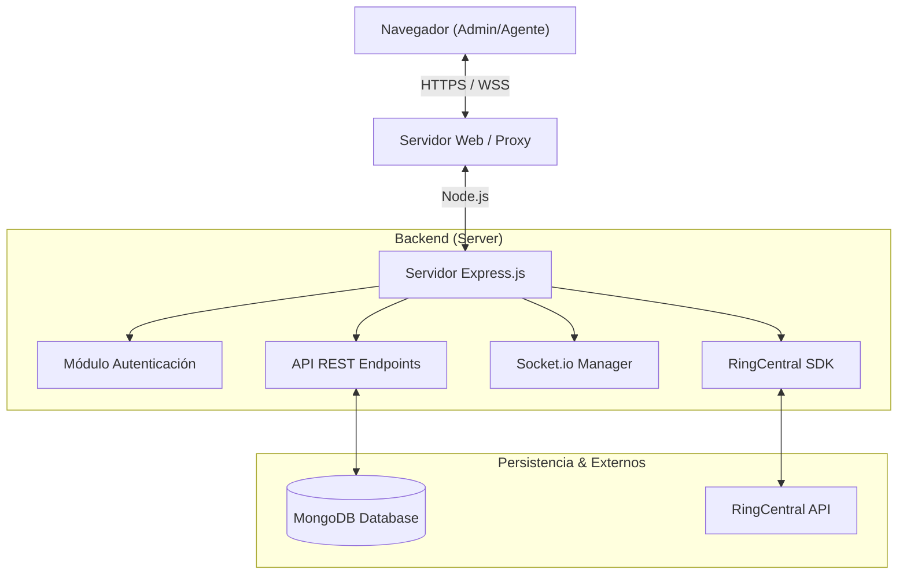

# Arquitectura del Sistema - Agent Center V1

Este documento describe la arquitectura técnica, el flujo de datos y las decisiones de diseño del sistema **Agent Center V1**.

## 1. Visión General

El sistema es una aplicación web monolítica moderna diseñada para la gestión de Call Centers. Sigue una arquitectura cliente-servidor donde:
- **Backend (Node.js/Express)**: Sirve la aplicación, gestiona la lógica de negocio, conecta con la base de datos y la API de RingCentral.
- **Frontend (Vanilla JS Modular)**: Una Single Page Application (SPA) "ligera" que gestiona la interfaz de usuario, interactuando con el backend vía API REST y WebSockets.

## 2. Diagrama de Arquitectura

## 3. Tecnologías Clave

### Backend
- **Runtime**: Node.js (Motor V8).
- **Framework Web**: Express.js.
- **Base de Datos**: MongoDB (Driver nativo `mongodb`).
- **Tiempo Real**: Socket.io para eventos bidireccionales (actualizaciones de dashboard, alertas).
- **Seguridad**:
    - `helmet`: Configuración de cabeceras HTTP seguras.
    - `bcryptjs`: Hashing de contraseñas.
    - `jsonwebtoken (JWT)`: Manejo de sesiones sin estado.
    - `express-rate-limit`: Protección contra fuerza bruta.

### Frontend
- **Lenguaje**: JavaScript (ES6+ Modules).
- **Estructura**: Modularizada en `public/js/modules/`.
- **Bundling**: Webpack (empaqueta múltiples módulos en un `bundle.js`).
- **Ofuscación**: `webpack-obfuscator` protege el código cliente en producción.
- **UI**: HTML5 + CSS3 (Variables CSS) + EJS (Renderizado inicial).

## 4. Flujo de Datos

1. **Inicialización**:
    - El servidor renderiza `index.ejs`, minificando el HTML al vuelo.
    - El cliente carga `bundle.js` (ofuscado).
    - Se establece conexión WebSocket y se verifica la sesión JWT.

2. **Operación de Agente**:
    - El agente interactúa con la UI (ej. tipificar una llamada).
    - El Frontend envía request POST al API.
    - El servidor valida token, actualiza MongoDB y emite evento Socket.io.
    - El Dashboard del Admin recibe el evento y actualiza gráficas en tiempo real.

3. **Integración RingCentral**:
    - El servidor se autentica con RingCentral usando credenciales de servicio.
    - Se pueden realizar llamadas o consultar logs a través del SDK integrado en el backend, actuando como proxy seguro.
